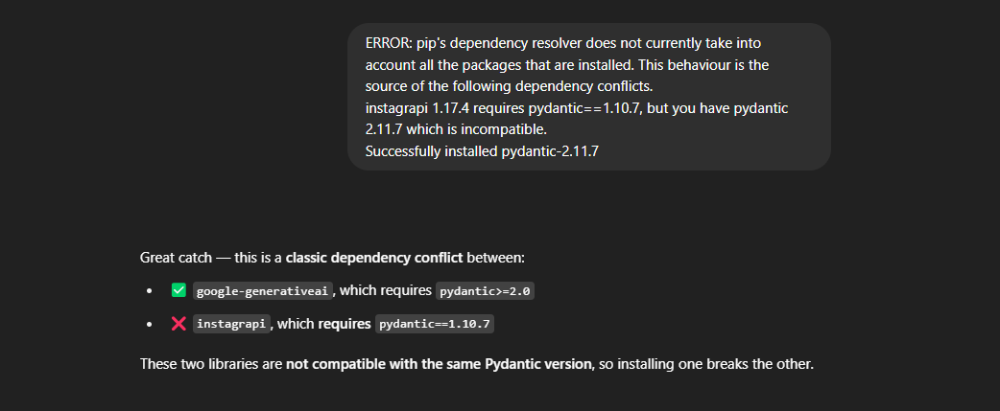
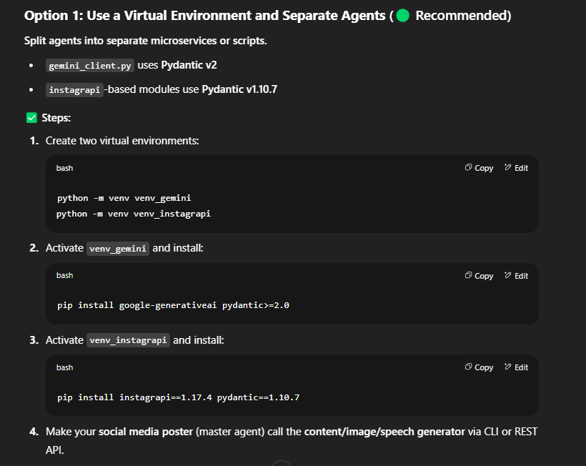

# ✅ Suggested Workflow

User Input / Trigger (e.g., Topic of the day)
↓
[Sub-Agent 1: Content Creator Agent] --> ✍️ Text
↓
┌────────────┬──────────────────┐
↓ ↓ ↓
[Sub-Agent 2: Image Generator] [Sub-Agent 3: Speech Generator]
↓ ↓
└────┬─────────────────────────────┘
↓
[Master Agent 1: Instagram Post Generator]
↓
[Master Agent 2: Social Media Scheduler]
↓
Post at 9PM to various platforms ✅

# 🤖 Multi-Agent Social Media Poster

A multi-agent AI system built using Python and Gemini API that automates content creation and social media posting every day at 9 PM.

---

## 🚀 Overview

This project uses a team of intelligent agents to:

- 📝 Create text content (e.g., motivational quotes, educational info)
- 🖼️ Generate an image based on the text
- 🔊 Create a voiceover from the text
- 📱 Combine these into an Instagram-ready post
- 📤 Automatically post it to social media (Instagram, Twitter, etc.)

---

## 🧠 Architecture

### Agents Involved:

#### 🔹 Sub-Agents:

- `Content Creator Agent`: Generates daily content using Gemini API
- `Image Creator Agent`: Creates image from text
- `Speech Creator Agent`: Converts text to speech

#### 🔹 Master Agents:

- `Instagram Post Creator`: Prepares the caption and media for upload
- `Social Media Scheduler`: Posts the content to various platforms at 9 PM

---

## 📁 Project Structure

````bash
multiagent_social_poster/
│
├── agents/
│   ├── content_creator_agent.py
│   ├── image_creator_agent.py
│   └── speech_creator_agent.py
│
├── master_agents/
│   ├── instagram_post_creator.py
│   └── social_media_scheduler.py
│
├── services/
│   ├── gemini_client.py
│   ├── text_to_speech.py
│   ├── image_utils.py
│   ├── video_creator.py
│   ├── social_media_api.py
│   └── scheduler.py
│
├── config/
│   ├── settings.py
│   └── prompts/
│       ├── content_prompt.txt
│       └── caption_prompt.txt
│       └── image_prompt.txt
├── outputs/
│   ├── images/
│   ├── audios/
│   ├── posts/
│
│
├── main.py
├── requirements.txt
├── README.md
└── .env


## 🛠️ Requirements

- Python 3.8+
- [Google Generative AI SDK](https://pypi.org/project/google-generativeai/) (`google-generativeai`)
- Other dependencies:
  - `gTTS` – for text-to-speech
  - `Pillow` – for image processing
  - `moviepy` – for video creation (image + audio)
  - `instagrapi` – for Instagram automation
  - `schedule` – for daily task scheduling
  - `python-dotenv` – for environment variable management

### virtual environment
    python -m venv venv_gemini
    python -m venv venv_instagrapi

### Install dependencies

```bash
pip install -r requirements.txt


### 🔐 Environment Variables
    Create a .env file in the root with the following keys:
    # Google Gemini API
    GOOGLE_API_KEY=your_google_gemini_api_key_here
    # Instagram Credentials
    INSTAGRAM_USERNAME=your_instagram_username
    INSTAGRAM_PASSWORD=your_instagram_password
    # YouTube OAuth Credentials (path to your JSON file)
    YOUTUBE_CLIENT_SECRET_FILE=path/to/client_secret.json
    # facebook Credentials (used by facebook-sdk)
    FACEBOOK_ACCESS_TOKEN = your_facebook_token
    FACEBOOK_PAGE_ID = your_facebook_page_id


### ▶️ How to Run
    First Activate virtual Enviornment
        Commands to activate venv environment
                    1) for gemini =>  venv_gemini\Scripts\activate
        Commands to deactivate venv environment
                     Type deactivate in teminal
    python main.py
        This will:
            Generate text + image + voice

            Prepare an Instagram post

            Schedule it for posting at 9 PM
    #### Version Confilict
        
        
        NOTE : Commands to activate venv environment
                    1) for gemini =>  venv_gemini\Scripts\activate
                    2) for instagram =>  venv_instagrapi\Scripts\activate
                Commands to deactivate venv environment
                    Type deactivate in teminal
### ⏰ Automating Daily Posting
You can use a cron job or APScheduler to run main.py every day:
        Example using cron (Linux/macOS):
            0 21 * * * /usr/bin/python3 /path/to/project/main.py
                This runs the script every day at 9:00 PM.
### 📌 Future Enhancements
    Add Telegram/YouTube/LinkedIn support
    Add feedback loop to improve content
    Dashboard to review and edit auto-generated posts

### 🧑‍💻 Author
    Kundan Prem Nayak
    Built with ❤️ and Python

### 📜 License
    MIT License
````
